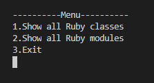
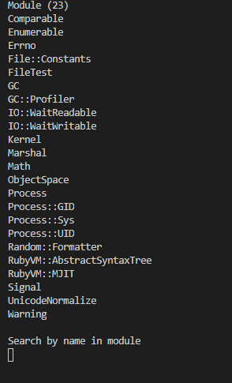
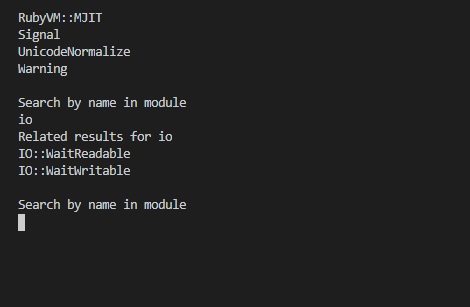
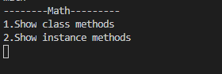
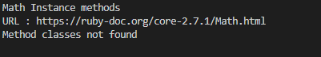
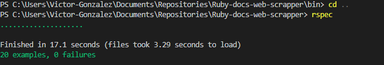

# Ruby-docs-web-scrapper

Hello ladies and gentlemen.

This is the Microverse Ruby capstone project in which I'm allowed to create a scrapper of the web-site of my desire.

I decided to create a scrapper for [Ruby-docs](https://ruby-doc.org/). In which you can see all Ruby classes, all ruby modules, and can also search for a specific class/module of your needs. You can choose whether you want it to display all class methods or you want all instance methods with its respective URL of class/module previously given.

## How it works

First of all, it will show you a menu like this: 



Here you can input an option number, input 1 if you want to see all classes, 2 if you want to see all modules, or 3 if you just want to get our of the program.

After inputting the desired option, you will see something like this (in this case I choose to see all modules):



As you can see all Ruby modules are displayed. Also, you can see there is a way you can search for a specific class/module. So I will try to search for the IO module to see what happens.



oh! it seems that there is no exact match for IO, however, ruby-docs-scrapper will drop a list of related results for your search and then ask you again for a specific module/class.

knowing that i'll input Math in the search field to see what happens next



Ruby-docs-scrapper will display another menu asking you for a number input depending on what you want to see, so you can either see all class methods or all instance methods. But if there are no methods for module/class searched, then it will drop the following message (fatal class in this case):


 As we all know there are no instance methods for the Math module. So This is what happens if I try to display instance methods for the Math module:



It will tell you that there are no instance methods Math module and also will provide you with a class/module URL.

However, Math has a bunch of class methods, so this is what happens if I try to display them: 


As expected, it will drop a list with all class methods together with the Math module URL.

## Environment set up requirements

To run this game, you need ruby installed in your environment.
Run the following command:

```
$ ruby -v
```

You should have a result similar to this:

```
ruby 2.6.5p114 (2019-10-01 revision 67812) [x86_64-linux]
```

If you don't get that result, follow this [link](https://www.ruby-lang.org/en/documentation/installation/) and install Ruby in your local environment.

## Getting Started

To get a local copy up and running follow these simple example steps

- fork the repository and create a local one on your computer
- move to the repository inside the command line using cd and the path to the file
- run `bundle install`
- to run the file enter `bin/main.rb` from inside the main folder in the repository
- use the Ruby-docs-scrapper


## Running the RSpec tests
[RSpec testing tool](https://rspec.info/) is being used to test all enumerable methods. 
Detailed documentation about this tool can be found [here](https://relishapp.com/rspec/docs)

## Install

- In a terminal window type `gem install rspec`
- Once rspec install has finished, type `rspec --init`
- You will see a folder spec and a file `.rspec`
- Inside spec folder you'll see a `spec_helper.rb` file.

## Run 
> For this project we have alredy created 2 files called `methods_spec.rb` and `url_spec.rb`. If you want to create another one, make sure you follow name required convetion: `[your file name] _spec.rb`. same way we created the 2 existing ones.


- Open `./spec/methods_spec.rb` and `./spec/url_spec.rb` file
- Open a terminal window and type `rspec`
- If all test were passed you will see:



Else you'll see a red message.

## Built With

- Ruby
- Nokogiri gem
- Rspec

## Live Demo

Comming soon...


## Author

👤 **Victor Manuel Gonzalez Buitrago**

- Github: [@Shaqri](https://github.com/Shaqri)
- Twitter: [@victorgonbu](https://twitter.com/victorgonbu)
- Linkedin: [linkedin](https://www.linkedin.com/in/victor-manuel-gonzalez-buitrago-8704731a5/)

## 🤝 Contributing

Contributions, issues and feature requests are welcome!

Feel free to check the [issues page](issues/).

## Show your support

Give a ⭐️ if you like this project!

## 📝 License

This project is [MIT](lic.url) licensed.